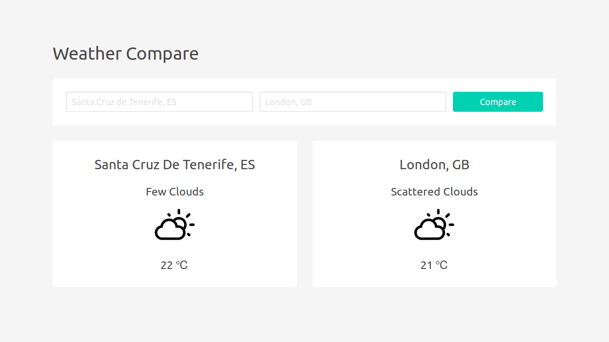

# JS Weather Compare

A simple app to compare the weather of two cities.

## Built With

- [Weatherbit API](https://www.weatherbit.io/api)
- [Local Storage](https://developer.mozilla.org/en-US/docs/Web/API/Storage/LocalStorage)
- [Bulma](https://bulma.io/)

## Screenshot

<kbd>
  
</kbd>
